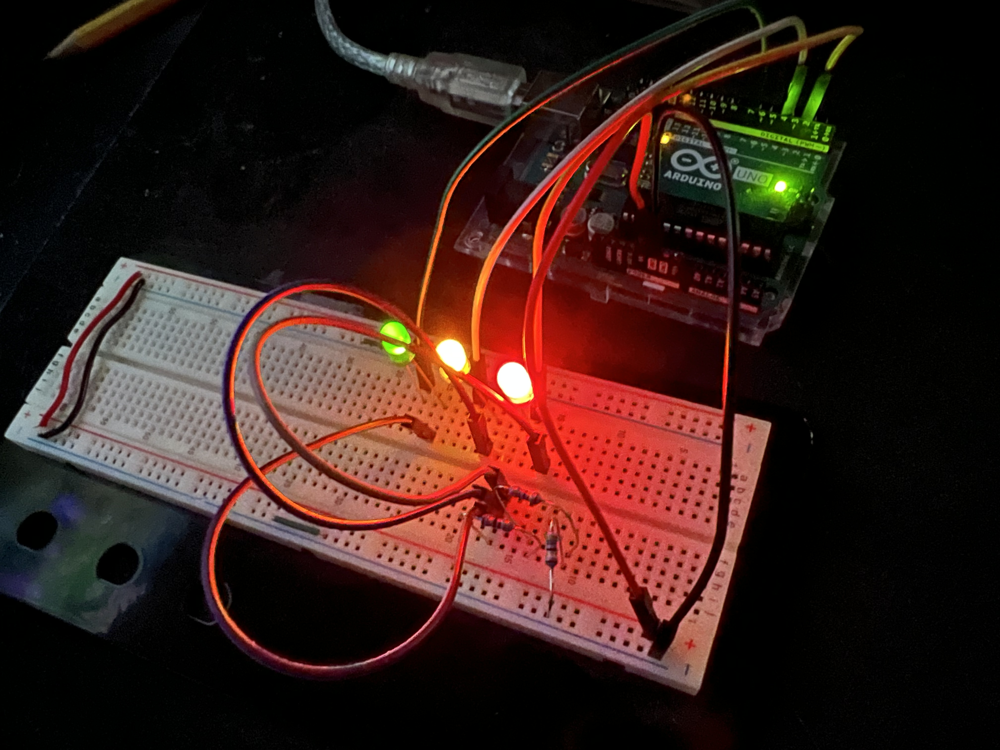

# Embedded System Learning
Group of embedded systems and relataed diagrams documenting my journey of re-learning embedded systems design.

I haven't done much with embedded systems since college. I have been wanting to get back into it for some robotics projects I plan to design and create. But before I can jump into a big project like that, I need to grasp the basics once again - which is exactly what this directory is for :).

## Traffic Lights
Simple starting project. Using 3 LEDs, the lights are lit up in the pattern green, yellow, red, before all turning back off. Each step is 1 second long. 

