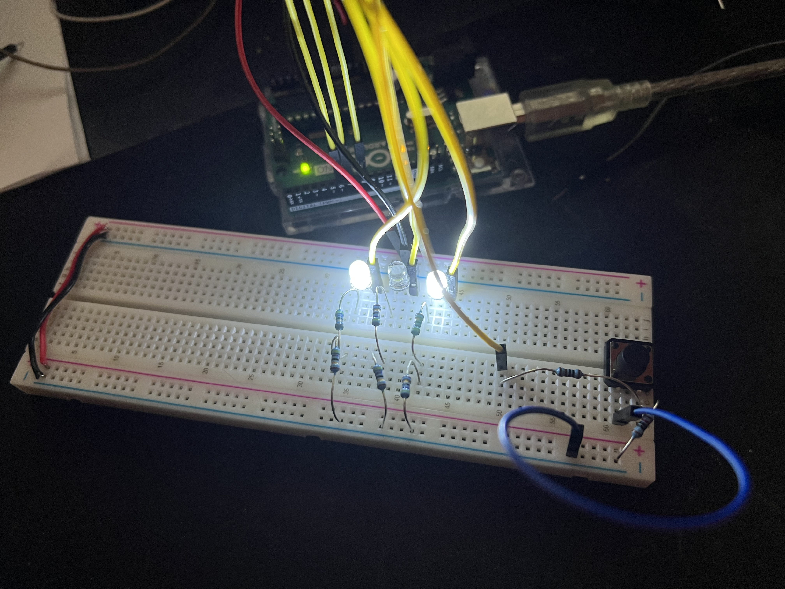
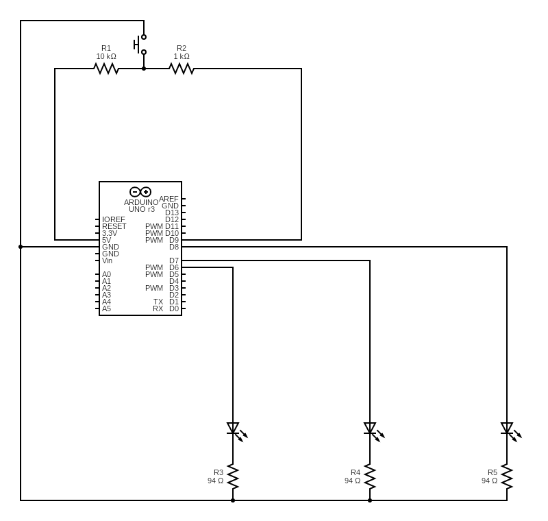

## Binary Counter
Simple beginner project. Uses 3 LEDs to present the binary value (read left to right in the image) of the counted value. Each button press increments the value up to 7. On the following press, the value resets to 0.

The code is written so adding additional LEDs is simple.

 

 

 

In the image you will notice there are six resistors. Each LED has two resistors in series to create a 94 ohm resistance. The button chosen was a simple push switch.