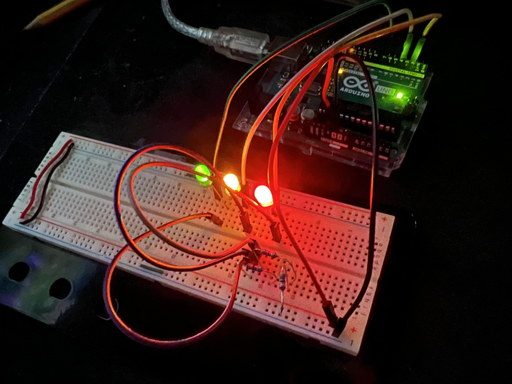

## Traffic Lights
Simple starting project. Using 3 LEDs, the lights are lit up in the pattern green, yellow, red, before all turning back off. Each step is 1 second long. 

In the image you will notice there are three resistors, which corresponds to the 141 ohm resistor in the circuit diagram. This is due to the limited resistors I had. In order to get around the 150 ohms I was aiming for, I used three 47 ohm resistors in series.